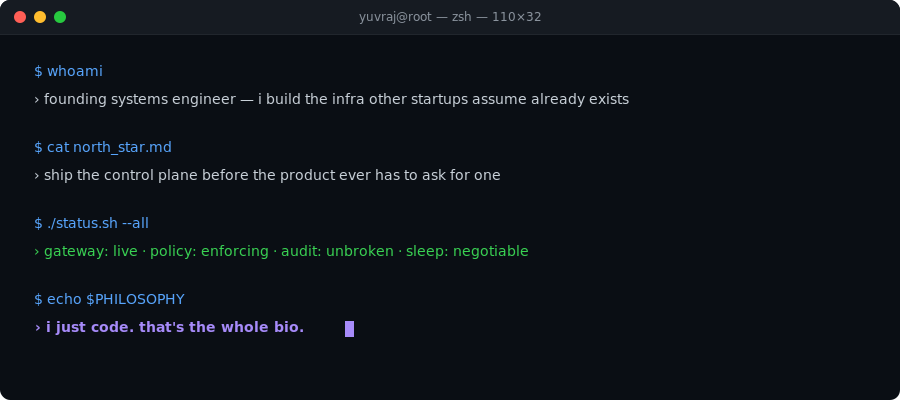
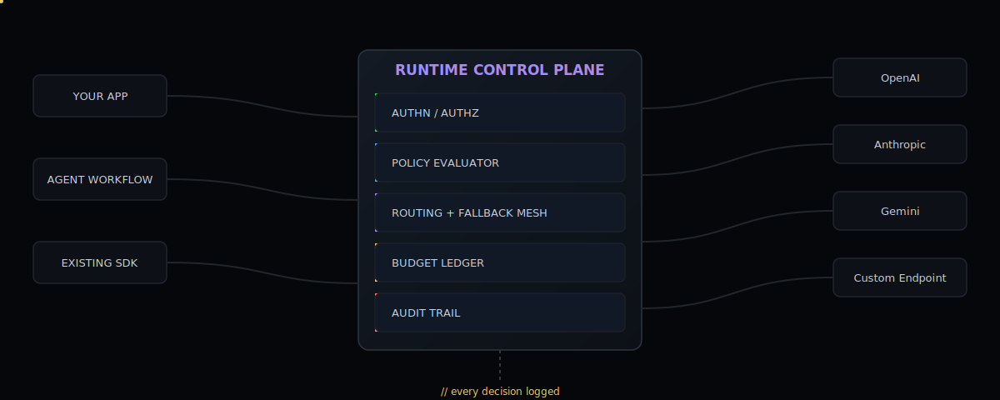

<div align="center">

<table border="0">
<tr>
<td width="130" align="center">

</td>
<td>

### YUVRAJ SINGH CHOWDHARY
**Founding Systems Engineer** — Runtime AI Infrastructure · Financial Operating Systems · Distributed Control Planes

</td>
</tr>
</table>



[](mailto:chowdharyyuvrajsingh@gmail.com)
[](https://www.linkedin.com/in/connectyuvraj/)
[](https://github.com/chowdhary19)
[](https://synvolv.com/)
[](#)
[](https://github.com/chowdhary19)

</div>


## `$ whoami`



I don't really do the personal-website-with-a-headshot-and-a-mission-statement thing. I do this instead — a terminal, because that's genuinely where I live most of the day.

Short version: I design and build the infrastructure that sits underneath AI products and trading operations — the layer between "the product works in a demo" and "the product survives contact with production." Request-path gateways. Policy evaluators. Provider orchestration. Usage ledgers. Reconciliation engines. Risk monitors. Audit trails. The stuff nobody screenshots for a launch post and everybody suddenly cares about the day it's missing.

Right now I'm the founding engineer building **[Synvolv](https://synvolv.com/)** — a runtime control plane that sits between AI products and the model providers they call, so that routing, budgets, policy, and provider spend are decided *before* they happen instead of reconciled after the invoice lands. In parallel, I built the operating backbone underneath **Blockhouse Capital's** trading desk — the unglamorous plumbing that keeps exchange connectivity, reconciliation, and risk visibility honest while real capital is actually moving. Before founder-mode, I spent a stretch at **Canonical** making sure other people's Linux infrastructure boots correctly on day one, because someone has to.

I don't ship demos. I ship the thing the demo was pretending to be.


## `$ git log --oneline --graph --decorate --all`

```text
* 4c9a2f1 (HEAD -> main, origin/synvolv) feat(gateway): ship OpenAI-compatible control plane to live traffic
* 8e1d0a3 feat(policy): enforce tenant budgets before provider spend commits
* 1f77b2c feat(routing): normalize every major model provider behind one contract
* 6b0d5e2 feat(ledger): make cost attribution a first-class citizen, not an afterthought
|
* d3b6e90 (origin/blockhouse) feat(quant-os): stand up trading desk operating layer from zero
* a02c88f feat(reconciliation): make exchange state and ledger state agree, always
* 77fe410 fix(risk): catch what fragmented CEX/DEX/broker data was quietly hiding
* 9c14f88 feat(reporting): give investors a control room instead of a spreadsheet
|
* 60021ab (tag: canonical-oss) feat(linux): ship Ubuntu cloud image validation upstream
* 2a417cd chore(ci): reduce release-day surprises for people I've never met
|
* 0000001 Initial commit — I just code.
```


## `$ cat architecture/gateway.md`

The pitch is simple: an AI product should not be able to spend money it doesn't have permission to spend, call a provider it isn't allowed to call, or run a request that violates policy — and it shouldn't need a rewrite to get that. Point an existing OpenAI-compatible client at the gateway, and every request now passes through a control plane before a single token leaves the building.



<div align="center"><sub><i>policy evaluated, budget checked, route decided — before a single token leaves the building.</i></sub></div>
<br/>

Under the hood, that box in the middle is doing the same job a payments processor does for money — except the currency is model tokens, and the fraud it's catching is a runaway agent loop instead of a stolen card. Auth and tenant identity resolve first. Policy gets evaluated against live budget state. The router picks a provider and model, with fallback baked in for when an upstream has a bad day. Every decision — allowed, throttled, rerouted, blocked — gets written to an audit trail that can answer "what happened and why" without anyone needing to SSH into anything at 2am.


## `$ ls -la ~/systems --sort=impact`

```text
drwxr-x---  founder  founder   synvolv-gateway/       # runtime control plane for live LLM traffic
drwxr-x---  founder  founder   blockhouse-quant-os/   # operating backbone for a live trading desk
drwxr-x---  founder  founder   canonical-oss/         # upstream Linux infra validation, Canonical
-rw-r--r--  founder  founder   .still-coding          # never modified, always open
```

<details>
<summary><b>$ cat synvolv-gateway/README.md</b></summary>
<br/>

The problem: teams wire an LLM provider into a product, and from that moment every prompt is an unmonitored operational and financial liability. No budget ceiling. No policy layer. No idea which feature, tenant, or workflow is actually driving spend until the bill shows up.

**Synvolv** is the fix — an OpenAI-compatible gateway an existing app can adopt with a config change, not a rewrite. Underneath it: policy evaluation, tenant budgets, provider routing and fallback, model normalization across every major provider, and a cost ledger that knows what a request is worth before the response even comes back. It's built to sit in the hot path of production traffic without anyone noticing it's there — until the day it stops a runaway workflow from doing real damage.

I own this end to end — architecture, backend, the control-plane UX operators actually use, and the design-partner conversations that keep it honest against how AI infra actually breaks once it leaves a notebook.

</details>

<details>
<summary><b>$ cat blockhouse-quant-os/README.md</b></summary>
<br/>

Blockhouse runs real capital across CEX, DEX, and broker venues, which means the "boring" stuff — reconciliation, margin visibility, execution monitoring, knowing exactly what you hold and what you owe, right now — is the whole game.

I built the operating layer underneath the desk: normalized account and position state across fragmented venues, real-time investor reporting, and exception handling for the stuff that silently goes wrong — failed fills, funding anomalies, delisting risk, ADL exposure. Plus the daily control room the team actually watches instead of a stack of dashboards nobody trusts.

```text
$ grep -r "financial-infra" ~/systems/blockhouse-quant-os/
CEX/DEX APIs · Broker APIs · IBKR · Order & Fill Pipelines · Account/Subaccount State
Execution Monitoring · Portfolio & PnL Systems · Margin/Liquidation Checks
ADL & Delisting Surveillance · DEX Signing · Replay Protection · Investor Reporting
```

This isn't a trading strategy. It's the infrastructure that makes running one, with other people's money, something you can actually defend.

</details>

<details>
<summary><b>$ cat canonical-oss/README.md</b></summary>
<br/>

Before founder-mode, I spent time making sure other people's infrastructure boots correctly in the first place — validating Ubuntu cloud and server images across provisioning, boot diagnostics, networking behavior, and package health at Canonical. Open-source, async-first, globally distributed team, code review as a way of life.

It's where I actually learned what "infrastructure" means: invisible when it works, extremely loud when it doesn't.

</details>


## `$ ls stack/`

**`ai-runtime/ + languages/`**
<br/>


**`backend + data/`**
<br/>


**`cloud + reliability/`**
<br/>


**`operator-surfaces + growth/`**
<br/>


<br/>




## `$ cat manifesto.txt`

- I don't ship demos. I ship the thing the demo was pretending to be.
- Uptime isn't a KPI I report on. It's a personality trait.
- I have read more provider API docs than I'd like to admit in a public document.
- If you're debugging a weird request at 2am, there's a decent chance one of my systems already logged exactly why.
- "0→1" isn't a resume word for me — it's just what happens when nobody else has built the thing yet, so I do.
- I don't do meetings about infrastructure. I do infrastructure.
- I just code. That's it. That's the whole bio.


## `$ ./github-stats.sh --live`

<div align="center">


<picture>
  <source media="(prefers-color-scheme: dark)" srcset="https://raw.githubusercontent.com/chowdhary19/chowdhary19/output/snake-dark.svg"/>
  <source media="(prefers-color-scheme: light)" srcset="https://raw.githubusercontent.com/chowdhary19/chowdhary19/output/snake.svg"/>
  
</picture>

</div>


<div align="center">

> "Strive not to be a success, but rather to be of value." — Albert Einstein

[](mailto:chowdharyyuvrajsingh@gmail.com)
[](https://www.linkedin.com/in/connectyuvraj/)
[](https://synvolv.com/)

</div>
