<div align="center">
  
</div>

<p align="center">
  <a href="https://synvolv.com/"></a>
  &nbsp;
  <a href="https://cal.com/heyyuvraj/chat"></a>
  &nbsp;
  <a href="mailto:chowdharyyuvrajsingh@gmail.com"></a>
  &nbsp;
  <a href="https://www.linkedin.com/in/connectyuvraj/"></a>
</p>

<br />

# The boy who followed the request

### A true-ish story about invisible machinery.

Long ago, roughly three production incidents ago, there was a boy who believed every button had a room behind it. Press the button, see the spinner, get the answer, move on. Everyone else did. He couldn't.

He wanted to know where the request went. So he opened the first door: API → service → queue → a worker that had quietly died eleven minutes earlier, no note.

Naturally, he kept walking.

## I · The first door

Software looked simple until someone pressed the same button twice. The function ran twice. A payment nearly did too.

> Computers are extremely obedient and have absolutely no common sense.

So he went looking for what the tickets never mention: locks, leases, retries, dead-letter queues, idempotency keys that were merely decorative, cron jobs everyone feared and no one owned.

```text
$ follow-request --from button

button → api → service → queue → worker → database → another service → someone else's assumption

warning: the assumption has no owner
```

By the time he found his way out, people called him a backend engineer. Too early in the story.

## II · The river that remembered

Next: a country where money moved as messages, blockchain, DeFi, whatever you call it. The river only cared whether the signature was valid.

A transaction could be visible but unfinished. A balance could be right at one block and wrong at the next. *Submitted* is not *happened*.

He stopped treating data as information. Data was a claim, and every claim needed evidence.

**What makes us certain this happened?** That question followed him into every system since.

## III · The counting house

Beyond the river: exchanges, brokers, positions, fills, PnL, and a dozen clocks that never agreed. One venue called an order closed. The database called it pending. The dashboard called everything green.

```text
venue_a.balance      10,004,122.17
venue_b.balance      10,004,121.94
internal_ledger      10,004,122.17

difference  0.23   status  unresolved   importance  extremely high
```

A financial system isn't a set of numbers. It's an argument about which number to believe. A useful system helps settle it, and builds control rooms for the people settling it, not prettier dashboards.

## IV · The mountain

Then came Linux, a mountain that didn't care the code worked on someone's laptop. Boot order, packages, permissions: the exact place where an assumption stopped being true.

He learned to reproduce failures before theorizing about them, and to love boring systems: they boot, they explain themselves, they let someone else sleep.

## V · The gate that charged before it opened

Eventually, a louder city, where every company was bolting intelligence onto something. Provider chosen, tokens spent, cost committed. Only *then* would a dashboard explain what happened. The decision came after the irreversible part.

So: what if the business decision lived *inside* the request path? Not a report. Not tomorrow morning. Before the spend.

That question became **Synvolv**: a runtime gatekeeper, not another dashboard watching from a safe distance.

```text
request arrives → who sent it? what's allowed? what's already spent?
                → which model? what if it fails? what will this cost?
                → can we defend this decision later?
decision leaves
```

I built it from an empty repository: routing, policy evaluation, a usage ledger, budgets, audit, fallback, operator controls. Then I made it fast enough to disappear. **~456 microseconds** of average overhead in the hot path, while still making a real decision. Not one of the fastest gateways. The fastest.

Quiet competence: the number of times the system decides correctly before a human even notices there was a decision to make.

<div align="center">
  
</div>

## VI · The map was bigger than the gate

Before AI runtime: blockchain and DeFi, exchange and broker integrations, orders and fills and reconciliation, Linux release engineering at Canonical scale. `Go` for the hot path, `Python` where the system had to move fast, `TypeScript` for the operator surface, `SQL` because every confident abstraction eventually has to explain itself to a database.

The technologies changed. The obsession didn't. I kept following the request.

<div align="center">
  
</div>

## VII · Six creatures every system meets

```text
the doppelgänger     same event, delivered twice, insisting they're different
the ghost             completes the job, loses the response, caller retries blind
the time traveller    yesterday's state arrives after today's; ordering beats timestamps
the hungry giant      spends money every call; policy has to sit before consumption
the mimic             returns 200 while the queue backs up behind it; uptime isn't reliability
the helpful fool      retries everything, enthusiastically, straight into a bigger outage
```

I've met all six. A few still send holiday cards.

## VIII · What I no longer believe

I no longer believe a feature that works is a system that's finished. That a dashboard equals visibility. That a retry is safe just because the first request timed out. That infrastructure, product and economics are separate departments.

I believe in systems that can answer plainly: *what happened, why, who decided, what did it cost, can it happen twice, can we reverse it, what should the operator do now.* If it can't, it isn't as intelligent as its dashboard suggests.

## IX · Why I became a founder

Not to stop engineering. To get the authority to follow a problem all the way to the end. A customer problem becomes a product decision becomes an API becomes a state model becomes infrastructure becomes cost becomes the business again. I like moving through the whole loop.

There's no one left to tell *"not my layer."* The architecture, the customer, the latency, the ugly migration, the mistake: all mine. So is the repair. Especially the repair.

<div align="center">
  
</div>

## X · The workshop notebook

```text
where does the truth live?              which operation is safe to repeat?
who is allowed to change it?            can the operator act, or only observe?
what becomes expensive under load?      if this breaks at 3am, what would I wish I'd built today?
```

More useful than most architecture diagrams I've seen.

## XI · The ledger at the back of the book

Stories are better than scoreboards. Still, a builder should show the marks left by the work.

<details>
<summary><strong>open the production ledger</strong></summary>

<br />

### At Synvolv

I architected and built the runtime AI gateway and control plane from zero. It has handled more than **17 million LLM requests per month** across scaled production environments, at approximately **456 microseconds** of average gateway overhead, normalising more than **200 models** across OpenAI, Anthropic, Gemini and custom endpoints.

It handles routing, fallback, tenant policy, model access, usage metering, budgets, rate limits, cost attribution, auditability, caching, request controls and runtime margin protection, and records full request lineage: tenant, feature, provider, model, latency, tokens, cost, route, policy, outcome.

### In financial infrastructure

I built operating systems around exchange and broker connectivity, account state, balances, positions, orders, fills, cash checks, reconciliation, PnL, margin and investor reporting, supporting approximately **$65M in assets under management** across **12 investor clients**, with surveillance across more than **20 exchanges** for market events, ADL risk and delistings.

I also worked across DEX signing, replay protection and non-custodial institutional flows.

### In Linux and platform engineering

Ubuntu cloud and server validation, provisioning, boot diagnostics, networking, package health, regression detection and release-readiness workflows, plus the Python and Linux tooling behind reproducible diagnostics, CI feedback and release-quality automation.

</details>

## XII · Footprints

A GitHub graph isn't proof anyone can design a system. A long streak can just mean good documentation commits. I don't worship the graph. But I like footprints; they show the traveller kept moving.

<div align="center">
  
</div>

<div align="center">
  
</div>

## XIII · Not finished yet

Most stories end at the castle. Inconvenient, since I have work tomorrow.

There are still control planes that only observe, ledgers that can't explain themselves, operators carrying entire recovery procedures in their heads, products that work beautifully in demos and panic the moment they meet production traffic.

Bring me the system everyone calls "mostly working." Bring me the process held together by one person's memory. Bring me the empty repository. Those are usually the good beginnings.

```text
$ tail -f story.log

[then]   opened the first door · followed the queue · followed the money
[then]   followed the state · followed the operator
[now]    building the gate
[next]   not written yet

█
```

<br />

> **La verko parolas kiam ĝia kreinto silentas.**
>
> The work speaks when its creator is silent.

<p align="center">
  <sub>
    Yuvraj Singh Chowdhary · founder · infrastructure engineer · still following the request
  </sub>
</p>
