<div align="center">
  
</div>

<p align="center">
  <a href="https://synvolv.com/"><code>synvolv</code></a>
  &nbsp;·&nbsp;
  <a href="https://cal.com/heyyuvraj/chat"><code>schedule a call</code></a>
  &nbsp;·&nbsp;
  <a href="mailto:chowdharyyuvrajsingh@gmail.com"><code>email</code></a>
  &nbsp;·&nbsp;
  <a href="https://www.linkedin.com/in/connectyuvraj/"><code>linkedin</code></a>
  &nbsp;·&nbsp;
  <a href="https://github.com/chowdhary19"><code>github</code></a>
</p>

<div align="center">

**I build the layer that decides what happens to money and model calls while the request is still alive.**

`builder of the fastest AI gateway control path I have ever put into production` — sub-millisecond authority in the hot path, before a token or a dollar is committed.

</div>

<br>

## `$ whoami --deep`

I am a **builder**. Not a founder-architect who draws the boxes and leaves, not an engineer who needs the problem pre-cut into tickets — the person who takes an empty repository and a business that can still fail, and comes back with a system that holds.

People try to put me in one box: backend, infrastructure, AI, quant, blockchain, platform. The honest answer is simpler. **I keep following a system until I reach the layer that can actually fail the business — and then I own that layer.**

I have shipped web products and automations, DeFi and signing flows, exchange and broker integrations, order and fill state machines, portfolio and cash reconciliation, risk monitors, Linux release tooling, distributed backends, AI gateways, policy engines, usage ledgers, and the operator control planes that sit on top of all of it.

That is not stack collecting. It is one instinct, applied over and over:

```text
a feature became a service            a service became a queue
the queue became a state machine      the state machine touched money
money required a ledger               the ledger disagreed with an exchange
the disagreement required an operator   the operator needed a control plane
the control plane sat in the hot path   the hot path had to disappear
```

> *"A complex system that works is invariably found to have evolved from a simple system that worked."* — **John Gall**

That is exactly how I build. Understand the business. Find the real invariant. Ship the smallest thing that is genuinely correct. Operate it. Watch where reality disagrees with the design — and then rebuild the part that was only pretending to work.

<br>

<div align="center">
  
</div>

<br>

## `$ cat /srv/synvolv/WHY`

[**Synvolv**](https://synvolv.com/) is what happened when that systems instinct met production AI.

AI teams had SDKs, gateways, dashboards and a monthly invoice — but almost **no authority during the only moment that matters: while the request is still in flight and the outcome can still be changed.** Spend is discovered after it is committed. Policy is a wiki page, not a runtime control. A runaway agent loop is a postmortem, not a blocked request.

So I built the control plane I wanted to exist, from an empty repository.

```text
INGRESS      OpenAI-compatible, drop-in — adopt it with a config change, not a rewrite
NORMALIZE    one contract over 200+ models across OpenAI, Anthropic, Gemini + custom endpoints
DECIDE       tenant identity -> policy snapshot -> budget counters -> route -> health-aware fallback
               evaluated in the request path, not after it
METER        token accounting, cost attribution, per-feature / per-tenant unit economics
ENFORCE      downgrade, cap, cache, reroute or block under margin pressure — before provider spend
PROVE        full request lineage: latency, tokens, cost, routing reason, applied policy, outcome
```

The engineering claim I care about most is **restraint under load**: I put one of the fastest AI gateway control paths I know of into production — **sub-millisecond average overhead in the hot path while still making real policy and routing decisions.** Infrastructure should never become the tax you pay for using infrastructure. The control layer has to be *fast enough to disappear, explicit enough to dispute, and complete enough to operate.*

> *"Perfection is achieved not when there is nothing more to add, but when there is nothing left to take away."* — **Antoine de Saint-Exupéry**

This is where systems engineering stops being a craft and becomes a business: latency is capacity, routing is gross margin, and a single policy decision is the difference between a healthy unit economic and a runaway one. I build for the reader who carries both a pager and a P&L.

<details>
<summary><strong>production receipts</strong> — numbers exist so systems can be disputed, not admired</summary>
<br>

```text
17M+       LLM requests / month across scaled design partners
~456 us    average measured gateway overhead — decisions made, not skipped
200+       models normalized across major providers and custom endpoints
< 5 min    OpenAI-compatible integration path

$65M       AUM supported by quant operating infrastructure I built with the team
12         investor clients supported through the operating build-out
20+        exchanges under market-event and delisting surveillance
```

</details>

<br>

## `$ ./inspect --builder --all-layers`

I am an infrastructure engineer in the broad, old-fashioned sense: I care about what runs **underneath** a product, **between** its components, and **immediately after** it fails.

I can sit at the request edge where every allocation and every microsecond matters, move into the ledger where every mutation needs a reason it can defend, and land on the operator surface where the system has to explain what it just did without anyone grepping six services at 3 AM.

```text
request paths        gateways · middleware · streaming · routing · rate control · hedged calls
financial state      double-entry ledgers · reconciliation · cash · PnL · margin · exposure
market connectivity  CEX / DEX / broker adapters · orders · fills · account & subaccount state
control systems      policy engines · budgets · RBAC / ABAC · audit · operator actions
data systems         transactional models · event pipelines · CDC · materialized read paths
reliability          idempotency · retries · backpressure · circuit breaking · recovery · SLOs
distributed systems  at-least-once vs exactly-once · consistency boundaries · replay · idempotency keys
platform work        Linux tooling · CI · release validation · containers · reproducible builds
```

> *"A distributed system is one in which the failure of a computer you didn't even know existed can render your own computer unusable."* — **Leslie Lamport**

A lot of software is **locally correct and globally wrong**. Every service returns `200`. Every dashboard is green. The customer still lost money, the balance still drifted, the retry still duplicated the charge, or the provider bill still ate the margin. I build against *that* class of failure — the one that only surfaces when two honest systems disagree.

<br>

## `$ ./languages --why-not-just-one`

The languages change; the shape of the work does not. I reach for a tool because of what the boundary demands, not because of what is trending.

```go
// Go — the hot path. boring, explicit, allocation-aware, fast.
func (g *Gateway) Route(ctx context.Context, req *Request) (*Decision, error) {
    if d, ok := g.cache.Get(req.Key()); ok {
        return d, nil                    // serve the p99 first
    }
    return g.policy.Evaluate(ctx, req)   // then spend authority, not before
}
```

```rust
// Rust — where a boundary earns the extra strictness.
enum Spend { Pending(Cents), Committed(Cents) }   // you cannot confuse the two by accident
// invalid states are unrepresentable; the compiler carries the invariant, not the reviewer.
```

```python
# Python — where the data, the operators and the money live.
def reconcile(ledger: Ledger, venue: Venue) -> list[Break]:
    return [b for b in diff(ledger, venue) if b.is_material]   # only real breaks page a human
```

```sql
-- SQL — where the truth is kept, and defended.
SELECT account_id, SUM(delta) AS balance      -- the ledger is the source of truth;
FROM   ledger_entries                         -- the exchange is required to agree with it,
GROUP  BY account_id;                          -- and reconciliation is how we make it prove that.
```

`Go` when the service must stay simple and fast. `Rust` when the boundary genuinely earns it. `Python` when the problem is data-heavy or operational. `TypeScript` when the operator surface and the backend have to evolve together. `PostgreSQL · ClickHouse · Redis · Kafka · RabbitMQ · Docker · Kubernetes · AWS · OpenTelemetry` are tools I know cold — none of them are my identity. **Keeping the whole path in view is.**

<br>

## `$ ./ready --seed-repo-to-large-firm`

I do my best work at 0→1, but I hold myself to the standard a large, review-heavy organization would demand — because the failures I care about do not respect company size.

```text
correctness      idempotency, reconciliation and recovery paths — not just green tests
reliability      SLOs and error budgets, blast-radius thinking, graceful degradation, runbooks
security         scoped keys, IP allowlisting, secrets hygiene, SSO / SAML / OIDC + SOC 2 readiness
observability    structured logs, metrics, traces, actionable alerts — systems that explain themselves
delivery         CI/CD, migrations, backfills, feature flags, reproducible builds, honest rollbacks
review           written design first, small diffs, and code the next engineer can trust
```

> *"The most dangerous phrase in the language is: we've always done it this way."* — **Grace Hopper**

I have shipped for three very different rooms — **AI teams running real production traffic, allocators moving real capital, and upstream Linux maintainers on a globally distributed open-source team at Canonical.** Different stakes, one standard of correctness. I can drop into an empty seed repo or a large platform team without changing how I think about the parts that fail.

<br>

## `$ cat ~/.notes-from-systems-that-fought-back`

```text
01  The happy path proves the demo. The recovery path proves the product.
02  A retry is a new state transition, not a second chance to forget the first one.
03  "Real-time" is a promise about freshness, ordering and recovery — not a WebSocket.
04  A ledger is the answer you can still defend after two systems disagree.
05  Tail latency is where a clean architecture stops being polite.
06  If a control cannot change the outcome, it is a report.
07  An automatic decision without evidence is tomorrow's argument.
08  The operator is part of the system. Design for the person carrying the pager.
09  Fast code with slow recovery is not a fast system.
10  A provider saying "accepted" does not mean the business state is correct.
11  Hidden state becomes visible during the worst possible incident.
12  The best infrastructure is boring only because someone did the hard thinking early.
```

> *"Everything fails, all the time."* — **Werner Vogels**, CTO, Amazon

I care about performance — but not benchmark theatre; I care about speed when it changes capacity, tail behavior or unit economics. I care about correctness — but not the kind that ends when the tests turn green; correct means the retry is safe, the ledger reconciles, the failure is visible, and the next operator has a clean move. And I care about taste: sharp names, fewer knobs, explicit ownership, small hot paths, honest metrics, no magic state, no ritual only one engineer remembers.

The best compliment my work can get is not that it looks clever. It is that the system is **real, understandable, and hard to accidentally betray.**

<br>

## `$ git log --all --author=yuvraj --stat`

These panels are generated **inside this repository** from real public GitHub history — a scheduled Action queries the account, renders the SVGs, and commits them back. No visitor-counter theatre. No trophy wall. No third-party statistics service waiting to disappear.

<div align="center">
  
</div>

<div align="center">
  
</div>

<br>

## `$ ./connect --problem-has-teeth`

I am most useful when the prototype worked and reality has started asking better questions.

Bring me the gateway that must disappear under load. The financial workflow that technically works but nobody trusts. The exchange integration with six definitions of "account state." The AI product whose usage is outrunning its unit economics. The queue that is fine until the same message arrives twice. The internal operation held together by a spreadsheet, a Slack channel and one person's memory.

I will trace the whole path, find the real invariant, and build the missing layer.

```text
company    https://synvolv.com/
call       https://cal.com/heyyuvraj/chat
email      chowdharyyuvrajsingh@gmail.com
linkedin   https://www.linkedin.com/in/connectyuvraj/
based      India · fluent across US / UK working hours
```

```text
yuvraj@production:~$ █
```
